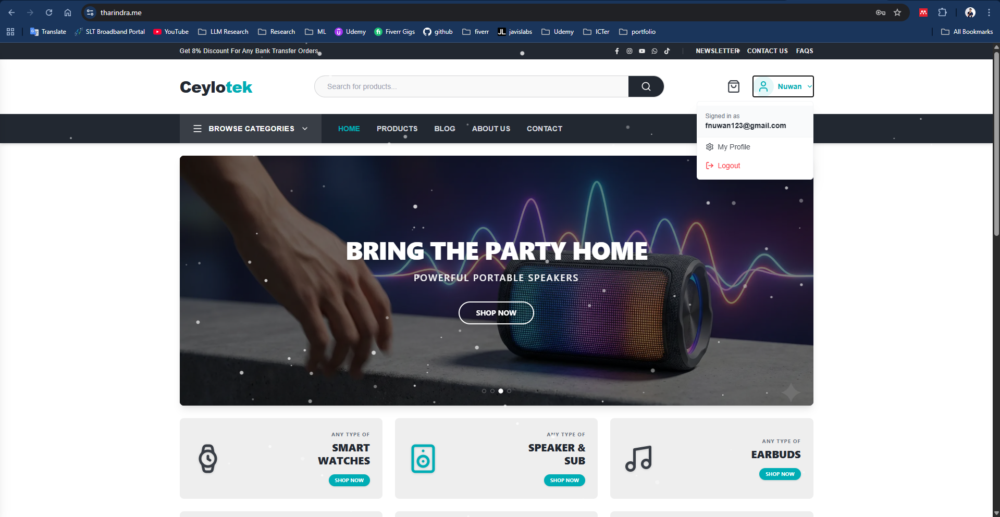
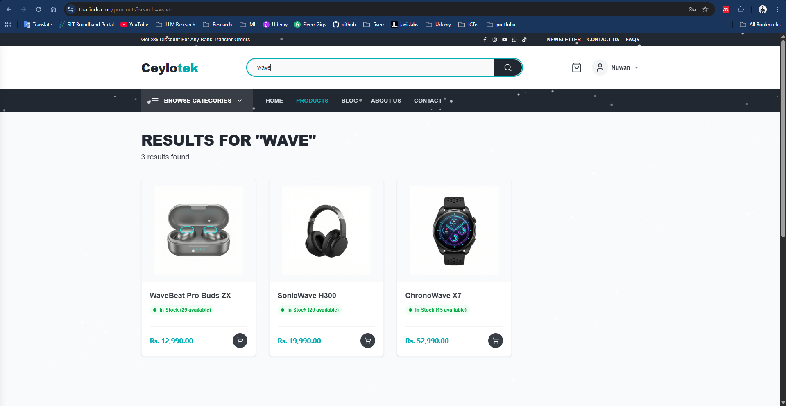
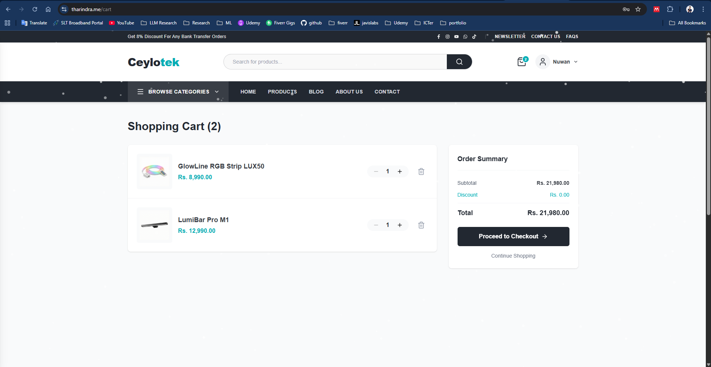
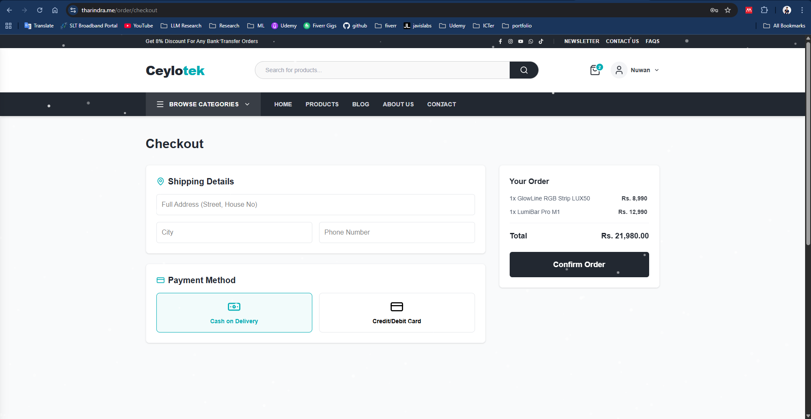
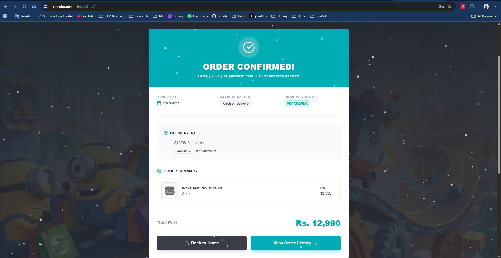
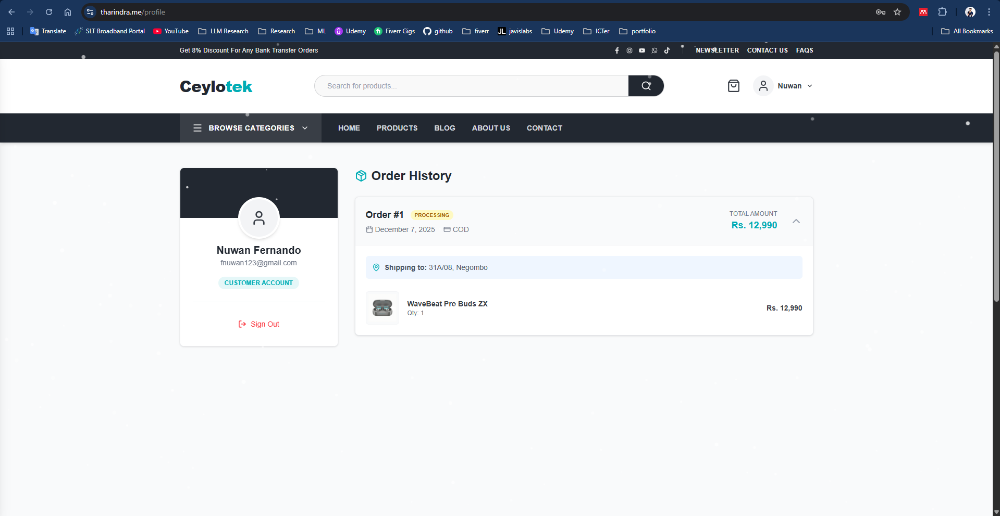
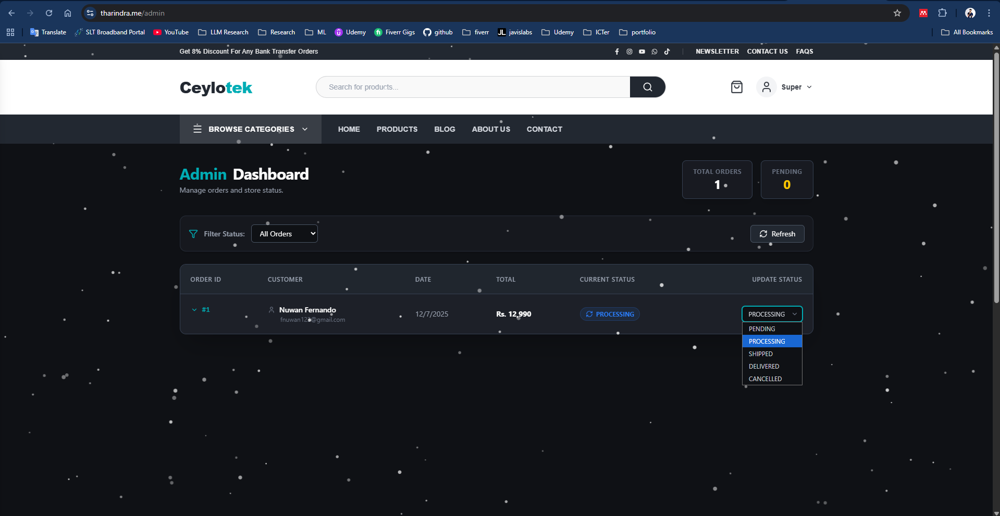
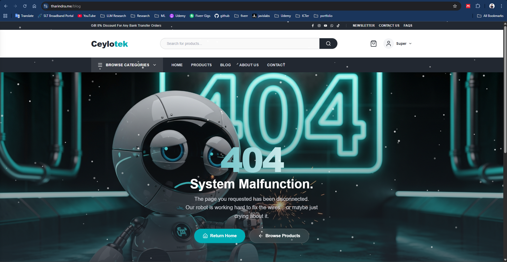

# Ceylotek Store – Frontend

Frontend application for the **Ceylotek Store** e-commerce platform, built with **Next.js**, **React**, and **TypeScript**.  
This application focuses on performance, scalability, and modern rendering strategies.

## 🚀 Tech Stack
- Next.js (App Router)
- React.js
- TypeScript
- Tailwind CSS / Ant Design (adjust if needed)
- JWT-based Authentication

## ⚙️ Rendering Strategy
- **Server-Side Rendering (SSR)** for dynamic product pages and dashboards
- **Static Site Generation (SSG)** for marketing and high-traffic pages

## 📸 Screenshots

















## 🛠️ Getting Started

```bash
npm install
npm run dev


